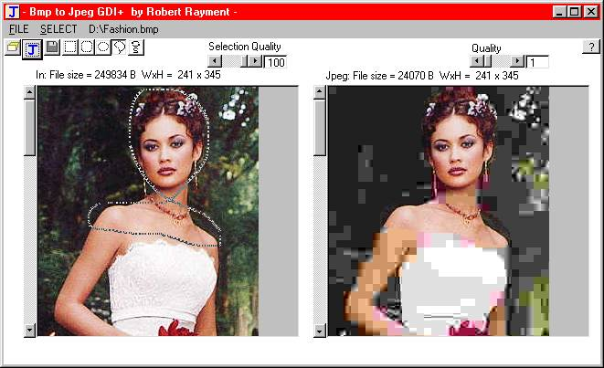

## BmpToJpeg GDI\+ version \(Quality & Regions\)

### Description

BmpToJpeg GDI+ version (Quality & Regions) by Robert Rayment. Converts bmp to jpeg. See effect of quality before saving. Selected regions can be of a different quality. Regions can be rectangle, rounded rectangle, oval or lasso. It appears that there are intermittent problems with ijl15.dll and Win2K. So this prog has used cut, paste & adapted code from Carles P V (CodeId=42376) & MrBoBo (CodeId=42488) for GDI+ which, if you haven't got it, can be downloaded at - www.microsoft.com/downloads/release.asp?releaseid=32738 - Install gdiplus.dll in your system or app folder. (Exe tested on XP Home) Win 2K, Win 98, Zip 241 KB (Couple of bmps included).
 
### More Info
 
Pics

Just run

             |
---                |---
**Submitted On**   |2003-10-24 07:09:14
**By**             |[Robert Rayment](https://github.com/Planet-Source-Code/PSCIndex/blob/master/ByAuthor/robert-rayment.md)
**Level**          |Intermediate
**User Rating**    |4.7 (84 globes from 18 users)
**Compatibility**  |VB 6\.0
**Category**       |[Graphics](https://github.com/Planet-Source-Code/PSCIndex/blob/master/ByCategory/graphics__1-46.md)
**World**          |[Visual Basic](https://github.com/Planet-Source-Code/PSCIndex/blob/master/ByWorld/visual-basic.md)
**Archive File**   |[BmpToJpeg\_16628210242003\.zip](https://github.com/Planet-Source-Code/robert-rayment-bmptojpeg-gdi-version-quality-regions__1-49426/archive/master.zip)

### API Declarations

See code, a few

